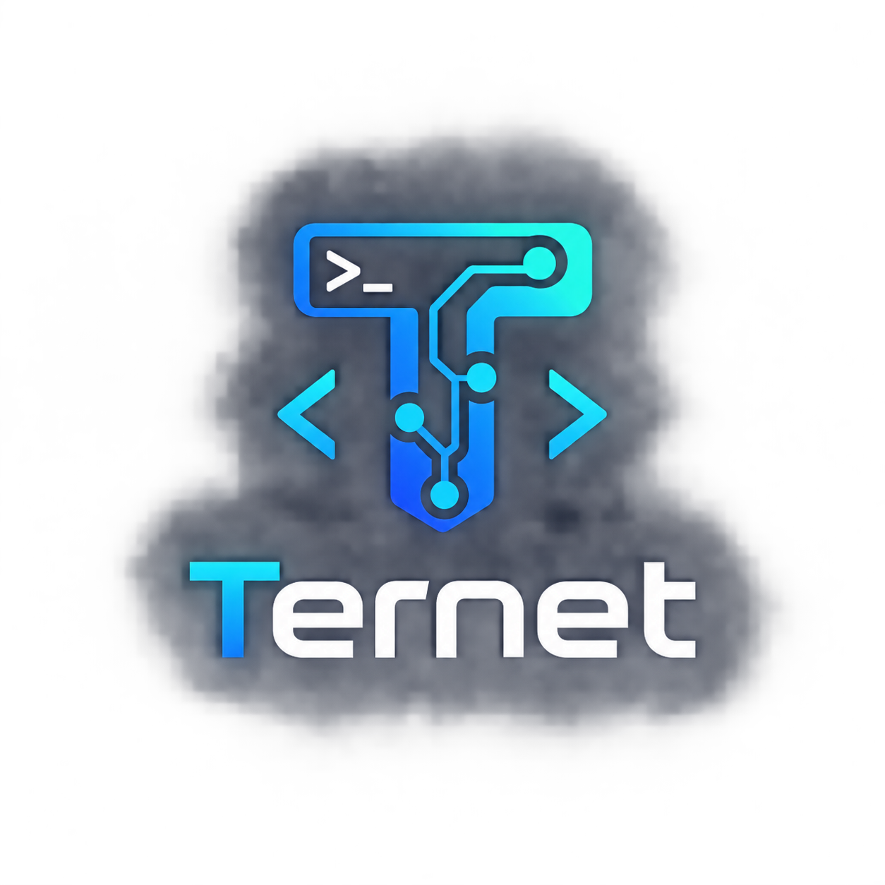

<div align="center">
  <a href="https://github.com/funnytamilan-1/ternet">
    
  </a>
  <h1>Ternet</h1>
  <p><strong>A modern, readable programming language built for software, web development, automation, and security tooling.</strong></p>
  <p>
    <a href="https://github.com/funnytamilan-1/ternet"></a>
    
    
    
  </p>
</div>

---

## What is Ternet?

Ternet is a C++17 programming-language project built around readable `.trn` source files, the `tnc` command-line tool, static type checker, reference interpreter, and bytecode compiler / TVM execution engine.

## Quick Start

```bash
cmake -S . -B build -DCMAKE_BUILD_TYPE=Release
cmake --build build --config Release --parallel
ctest --test-dir build --output-on-failure -C Release
```

Run source code:
```bash
./build/tnc run examples/hello.trn
```

Type check source code:
```bash
./build/tnc check examples/hello.trn
```

Format and lint:
```bash
./build/tnc fmt examples/hello.trn
./build/tnc lint examples/hello.trn
```

Interactive REPL:
```bash
./build/tnc repl
```

Compile and execute bytecode:
```bash
./build/tnc build examples/hello.trn -o hello.tbc
./build/tnc exec hello.tbc
```

---

## Language Features

### Hello World

```trn
tnprint("Hello, Ternet"):
tnprint("Welcome to .trn"):
```

Statements support `:` or `;` terminators.

### Variables & Types

```trn
let name: String = "Ternet":
mut score: int = 10:
score = 20:
const answer: int = 42:

tnprint(name):
tnprint(score):
tnprint(answer):
```

Supported primitive and compound types:
- `int`, `uint`, `int8`, `int16`, `int32`, `int64`, `uint8`, `uint16`, `uint32`, `uint64`
- `float`, `float32`, `float64`
- `bool`, `char`, `byte`, `String` / `str`
- `void`, `never`, `null`
- `List<T>`, `Array<T>`, `Map<K, V>`, `Tuple`
- `Option<T>`, `Result<T, E>`
- Structs, Enums, Classes, Traits / Interfaces

### Lists

```trn
let numbers: List<int> = [1, 2, 3]:
numbers.append(4):
let first = numbers[0]:
tnprint(first):

let popped = numbers.pop():
tnprint(popped):
tnprint(numbers.len()):
```

### Tuples

```trn
let user: (String, int, bool) = ("Ajmal", 15, true):
let name = user.0:
let age = user.1:
let active = user.2:

tnprint(name):
tnprint(age):
tnprint(active):
```

### Classes & Object-Oriented Programming

Real inheritance, constructors (`init`), fields, `this`, `super`, `virtual`, `override`, and polymorphism:

```trn
class Animal {
    virtual fn speak() {
        tnprint("Animal"):
    }
}

class Dog extends Animal {
    override fn speak() {
        tnprint("Dog"):
    }
}

fn main() {
    let animal: Animal = Dog():
    animal.speak(): // Outputs "Dog" via virtual dispatch
}

main():
```

### Traits & Interfaces

```trn
trait Drawable {
    fn draw()
}

class Player implements Drawable {
    fn draw() {
        tnprint("Player"):
    }
}

let player: Drawable = Player():
player.draw():
```

### Generics

```trn
fn identity<T>(value: T) -> T {
    return value:
}

let num = identity(42):
let text = identity("Ternet"):
tnprint(num):
tnprint(text):

class Box<T> {
    let value: T

    fn init(val: T) {
        this.value = val:
    }

    fn get() -> T {
        return this.value:
    }
}

let box = Box(100):
tnprint(box.get()):
```

### Option & Result

```trn
let some_val = some(42):
let none_val = none():

tnprint(is_some(some_val)): // true
tnprint(unwrap_or(some_val, 0)): // 42
tnprint(unwrap_or(none_val, 100)): // 100

let res = ok("success"):
match res {
    ok(v) => tnprint("Success:", v):
    err(e) => tnprint("Failed:", e):
    _ => tnprint("other"):
}
```

### Pattern Matching

```trn
enum Status {
    IDLE,
    RUNNING,
    FAILED
}

let status = Status.RUNNING:

match status {
    Status.IDLE => tnprint("idle"):
    Status.RUNNING => tnprint("running"):
    _ => tnprint("other"):
}
```

### Error Handling

```trn
try {
    throw "something went wrong":
} catch (e) {
    tnprint("Caught error: " + e):
} finally {
    tnprint("Cleanup completed"):
}
```

### Standard Library & Built-ins

```trn
// Strings
let text = "hello world":
tnprint(text.to_upper()):
tnprint(text.contains("world")):
tnprint(text.substr(0, 5)):

// Math
tnprint(abs(-42)):
tnprint(min(10, 20)):
tnprint(max(10, 20)):
tnprint(sqrt(16)):
tnprint(pow(2, 8)):

// Filesystem & Environment
fs_write("test.txt", "hello"):
tnprint(fs_exists("test.txt")):
tnprint(fs_read("test.txt")):
fs_remove("test.txt"):
```

### Module System

```trn
import "modules/greet.trn":

let message = greet("Ternet"):
tnprint(message):
```

---

## Toolchain & CLI

| Command | Description |
|---|---|
| `tnc run <file.trn>` | Run Ternet source using reference interpreter |
| `tnc check <file.trn>` | Perform static type checking and semantic validation |
| `tnc build <file.trn> -o <file.tbc>` | Compile Ternet source to verified bytecode |
| `tnc exec <file.tbc>` | Execute compiled bytecode in the TVM |
| `tnc fmt <file.trn>` | Format source code deterministically |
| `tnc lint <file.trn>` | Lint source code for style and potential bugs |
| `tnc repl` | Start interactive Ternet REPL |
| `tnc init [dir]` | Initialize a new Ternet package with `ternet.toml` |
| `tnc add <pkg> <ver>` | Add dependency to `ternet.toml` |
| `tnc install` | Install dependencies and generate `ternet.lock` |
| `tnc remove <pkg>` | Remove dependency |
| `tnc list` | List dependencies |
| `tnc package` | Build package distribution artifact |

---

## Testing

```bash
ctest --test-dir build --output-on-failure -C Release
```

All 54 test suites pass with 100% verification across lexer, parser, static type checker, interpreter, bytecode compiler, and TVM.

## License

See LICENSE for details.
