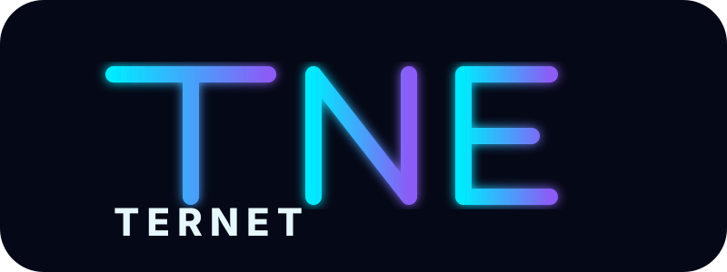

<div align="center">
  <a href="https://github.com/funnytamilan-1/ternet">
    
  </a>
  <h1>Ternet</h1>
  <p><strong>A modern, readable programming language built for software, web development, automation, and security tooling.</strong></p>
  <p>
    <a href="https://github.com/funnytamilan-1/ternet"></a>
    
    
    
  </p>
</div>

---

## What is Ternet?

Ternet is a C++17 programming-language project built around readable `.trn` source files, the `tnc` command-line tool, a reference interpreter, and a bytecode/TVM execution path.

> **Truthful status:** Ternet is actively implemented, but it is **not yet a completely finished production programming language**. Some advanced language features, standard-library modules, package infrastructure, resource controls, native compilation, and security enforcement are still under development.

## Quick start

```bash
cmake -S . -B build
cmake --build build
./build/tnc run examples/hello.trn
./build/tnc check examples/hello.trn
```

Compile and execute bytecode:

```bash
./build/tnc build examples/hello.trn -o hello.tbc
./build/tnc exec hello.tbc
```

## Hello Ternet

```trn
tnprint("Hello, Ternet"):
tnprint("Welcome to .trn"):
```

Statements can currently use `:` or `;` terminators.

## Variables

```trn
let name = "Ternet":
mut score = 10:
score = 20:
const answer = 42:

tnprint(name):
tnprint(score):
tnprint(answer):
```

`let` and `const` bindings are immutable in the current runtime; `mut` creates a mutable binding.

## Global / top-level scope

```trn
let app_name = "Ternet":
mut request_count = 0:

lit show_app() {
    tnprint(app_name):
}

show_app():
```

Top-level bindings currently live in the program's top-level execution scope. A complete separate-compilation/global-linker ABI is still future work.

## `lit` functions

`lit` is Ternet's function declaration keyword. It is **not a datatype**.

```trn
lit add(a, b) {
    return a + b:
}

let result = add(20, 22):
tnprint(result):
```

`fn` remains supported:

```trn
fn multiply(a, b) {
    return a * b:
}
```

## Functions and recursion

```trn
lit square(x) {
    return x * x:
}

tnprint(square(12)):
```

Recursive example:

```trn
lit fact(n) {
    if {n <= 1}; {
        return 1:
    }
    return n * fact(n - 1):
}

tnprint(fact(5)):
```

## Runtime values

The current `Value` representation includes:

| Type | Example |
|---|---|
| null | `null` |
| bool | `true` |
| integer | `42` |
| float | `3.14` |
| string | `"hello"` |
| array | `[1, 2, 3]` |
| object | runtime object representation |

## Operators

```text
+  -  *  /  %
== !=
>  <  >= <=
&& ||
!
```

Example:

```trn
let a = 10:
let b = 3:

tnprint(a + b):
tnprint(a - b):
tnprint(a * b):
tnprint(a / b):
tnprint(a % b):
tnprint(a > b):
tnprint(a == 10):
```

Division by zero is rejected by the runtime.

## Strings

```trn
let text = "line1\nline2":
tnprint(text):
```

## Arrays

```trn
let numbers = [10, 20, 30, 40]:
tnprint(numbers[0]):
tnprint(numbers[3]):
```

Out-of-range array access raises a runtime error.

## Conditions

```trn
let age = 15:

if {age >= 18}; {
    tnprint("adult"):
} else {
    tnprint("minor"):
}
```

## Loops

`while`, `break`, and `continue` are supported in the runtime/compiler paths.

```trn
mut count = 0:

while {count < 5}; {
    tnprint(count):
    count = count + 1:
}
```

The `for` syntax exists in the language vocabulary, but its complete surface semantics remain under active development.

## Structs, enums and match

The language now has compiler/runtime foundations for struct member access, enums, and basic matching.

Example direction:

```trn
enum Status {
    IDLE,
    RUNNING,
    FAILED
}

let status = Status.RUNNING:

match status {
    Status.IDLE => tnprint("idle"):
    Status.RUNNING => tnprint("running"):
    _ => tnprint("other"):
}
```

Advanced classes, traits, interfaces and generic user-defined types remain under development.

## Modules / imports

Local `.trn` imports are supported through the current source loader.

```trn
import "modules/greet.trn":
```

The loader recursively resolves local modules and detects cyclic imports. Full separate compilation, exported namespaces, remote packages and linker-level module ABI remain future work.

## Option / Result

Ternet's compiler/runtime has tagged `some`, `none`, `ok`, `err`, and `unwrap_or` foundations. The standard-library API is still being expanded.

## Web generation

Ternet can generate files into `dist/`:

```trn
webfile "index.html" {
    "<!doctype html>":
    "<html><body>":
    "<h1>Hello from Ternet</h1>":
    "</body></html>":
}
```

The bytecode path also has webfile lowering/execution support. Absolute paths and parent-directory traversal are rejected.

## Bytecode / TVM

```text
Ternet source
    |
    v
Lexer
    |
    v
Parser / AST
    |
    +----> Reference Interpreter
    |
    v
Bytecode Compiler
    |
    v
Bytecode + Verifier
    |
    v
TVM
```

The bytecode path covers core expressions, variables, arrays/indexing, control flow, short-circuit operations, function calls/returns, structs/member operations, enums/match, local imports, and webfile output.

## Static checker

```bash
./build/tnc check file.trn
```

The checker covers core literals, bindings, arithmetic/comparison, arrays, function arity, assignments, conditions, returns and several statement forms.

It is **not yet** a complete ownership/borrowing, generics, trait, lifetime or advanced-inference checker.

## Package commands

```bash
tnc init
tnc add json 1.0.0
tnc list
tnc install
tnc remove json
tnc package
```

The current package implementation manages project metadata, lockfiles and local package state. A production remote registry, dependency solver, downloads, checksums and signatures are still under development.

## Standard library roadmap

Planned/expanding modules include:

```text
core
string
collections
option
result
math
random
fs
path
io
json
toml
csv
net
http
tls
url
websocket
async
sync
channel
crypto
process
env
terminal
log
test
bench
```

The presence of a name in this roadmap does **not** mean every API is already implemented.

## Security architecture

Ternet is designed around a verifier/runtime trust boundary:

```text
Source -> Lexer -> Parser -> Semantic analysis
      -> IR/Bytecode -> Verifier -> TVM
```

Future capability examples include:

```text
fs.read
fs.write
net.connect
net.listen
process.spawn
secret/environment access
native FFI
raw sockets
```

A security design is not considered an implemented security feature until enforcement and regression tests exist.

## Resource limits

Future runtime controls include CPU time, wall-clock timeout, heap/RAM, call depth, output size, file size and network usage.

## Toolchain roadmap

- Generics and advanced type inference
- Option/Result refinement
- Classes and methods
- Traits/interfaces
- Ownership and borrowing
- Async/await scheduler
- Production filesystem/network/HTTP/TLS/JSON/crypto libraries
- Full module namespaces and separate compilation
- Remote package registry and dependency solving
- Package integrity/signatures
- Capability enforcement
- Resource limits
- Full bytecode exception handling
- LSP and DAP debugger
- Formatter and linter
- REPL
- Native backend
- WebAssembly backend
- Production web framework
- Full IDE
- Browser playground
- Cross-platform release/toolchain

## Repository structure

```text
Include/                 Public C++ interfaces
Parser/                  Lexer + parser
Ternet/                  Reference runtime
compiler/                Bytecode + type checker
Programs/tnc/            CLI
Tools/                   Package commands
Modules/                 External integrations
tests/                   Regression tests
examples/                User examples
docs/                    Specifications and design
syntaxes/                TextMate grammar
contrib/                 Contribution aids
assets/                  Project branding/assets
```

## Editor and GitHub support

Ternet source uses `.trn`. The repository includes TextMate syntax grammar, Linguist preparation and editor-oriented metadata.

Global GitHub Linguist recognition requires acceptance of the relevant upstream language-definition change; repository files alone do not register a language globally.

## Testing

```bash
ctest --test-dir build --output-on-failure
```

Every implemented feature should have positive and negative regression coverage where meaningful.

## Development principles

### No fake compiler features

A feature is not called implemented because its syntax appears in a README.

### Implementation before marketing

Parser, runtime/compiler behavior and tests must exist before a feature is advertised as working.

### Documentation follows code

When implementation changes, the README and relevant docs must be updated.

### Security is enforcement

A security design document alone is not a security feature.

### Small verified steps

Large language changes should be split into focused commits so regressions are easy to locate.

## Contributing

```bash
git checkout main
git pull
cmake -S . -B build
cmake --build build
ctest --test-dir build --output-on-failure
```

A good contribution contains implementation, tests and documentation together.

## License

See the repository license file for the project's current licensing terms.
